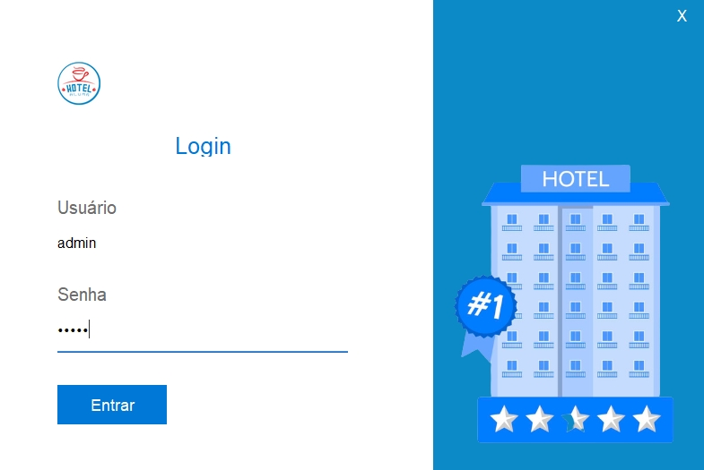
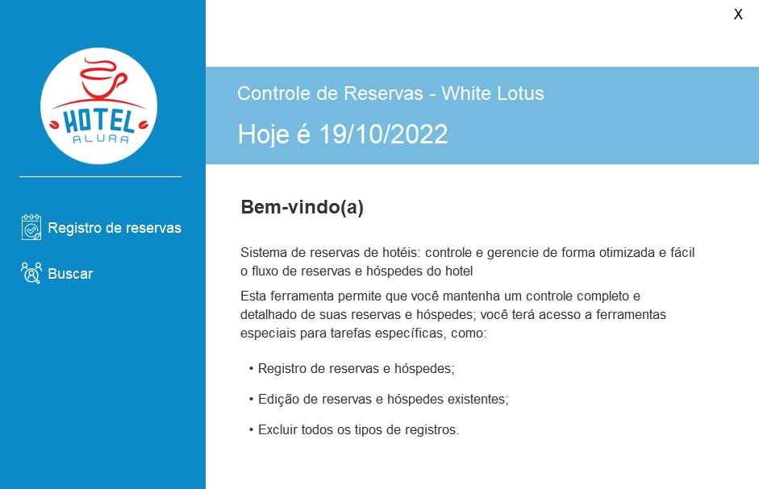
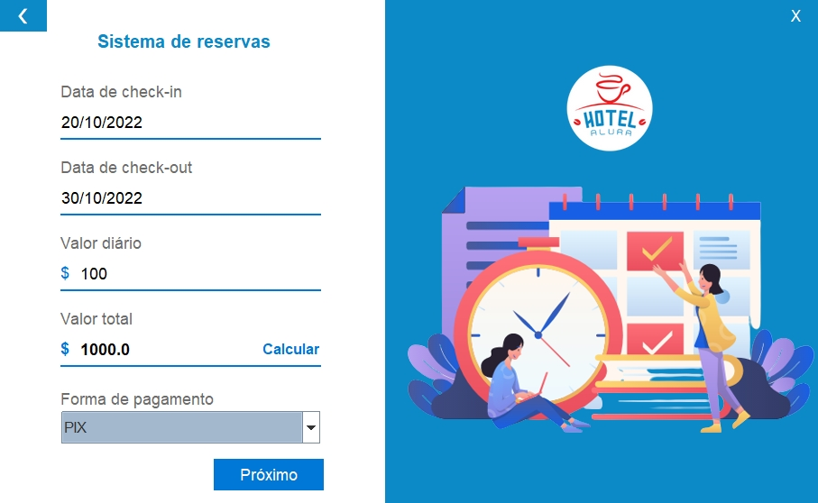
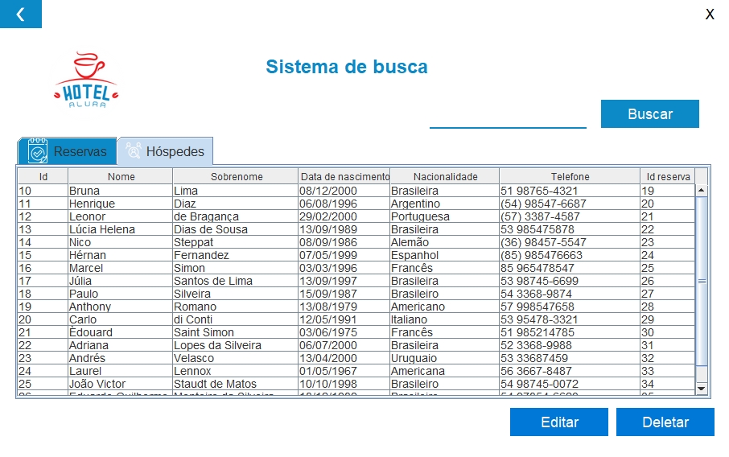

# Sistema de hotel integrado com banco de dados

Uma aplicação desktop que simula o sistema de um hotel conectado a um banco de dados para manter reservas e hóspedes. Desenvolvida com Java, utilizando Swing para a interface gráfica, e conectada com MySQL.

## Índice

- [Sobre o projeto](#sobre-o-projeto)
- [Menu principal](#menu-principal)
- [Registro de reservas](#registro-de-reservas)
- [Registro de hóspedes](#registro-de-hóspedes)
- [Consulta ao banco de dados](#consulta-ao-banco-de-dados)
- [Telas](#telas)
- [Updates](#updates)

## Sobre o projeto

Este foi o último challenge do [programa ONE](https://www.oracle.com/br/education/oracle-next-education/ "Oracle Next Education"). A identidade visual do projeto é o "Hotel Alura", posto que a Alura forneceu as imagens e modelos para o design da aplicação. 

Os principais requisitos do projeto eram:

- Sistema de autenticação de usuários, para que somente usuários pertencentes ao hotel possam acessar o sistema;
- Manter reservas e hóspedes;
- Calcular o valor da reserva com base no número de dias e no valor da diária, informados no momento do cadastro;
- Banco de dados para armazenar todos os dados solicitados anteriormente.

Decidi por codar o projeto 100% em inglês, porém mantive a interface em português.

**O único acesso ao sistema é por meio do login  e senha "*admin*"**, pois o foco do projeto era a integração com o banco de dados por meio do cadastro de reservas e hóspedes.

### Menu principal

Aqui são exibidas a data atual e as informações do sistema. O usuário tem a opção de registrar uma nova reserva ou de consultar o banco de dados.

### Registro de reservas

Consiste em uma tela com 5 campos que devem ser preenchidos pelo usuário:

- Data de check-in;
- Data de check-out;
- Valor da diária;
- Valor total;
- Forma de pagamento.

As datas são formatadas com *JFormattedTextField* e validadas com a classe *LocalTime*; não é possível inserir uma data passada nem inserir um check-out anterior ao check-in. O sistema também reconhece anos bissextos e altera o valor do campo caso a data esteja incorreta.

O valor da diária também deve ser preenchido pelo usuário; após isso, ao clicar no botão **calcular** no campo **valor total**, o programa multiplica a quantidade de dias pelo valor da diária e exibe o valor total no campo.

Após isso, o usuário seleciona a forma de pagamento em uma *combo box* e clica em próximo.

Todos os inputs são validados e, caso atendam aos critérios, o usuário recebe uma confirmação do cadastro, o *Id* da reserva e é redirecionado à tela de registro de hóspede.

Caso algum input não esteja válido, uma mensagem é exibida para que o usuário preencha o campo corretamente.

### Registro de hóspedes

Consiste em uma tela com 6 campos que devem ser preenchidos pelo usuário:

- Nome;
- Sobrenome;
- Data de nascimento;
- Nacionalidade;
- Telefone;
- Id da reserva.

Nome, sobrenome e nacionalidade são campos de texto normais, apenas com limite de caracteres e que devem ser preenchidos.

A data de nascimento, assim como outros inputs de datas, é formatada com *JFormattedTextField* e validada com a classe *LocalTime*; **para que um hóspede possa ser registrado, ele deve ter mais que 21 anos**.

O telefone é validado com uma *regex* no padrão brasileiro, podendo conter parênteses, espaços e/ou hífen e devendo conter o ddd do estado; são aceitos números residenciais (ddd + 8 dígitos) e celulares (ddd + 9 seguido de 8 dígitos).

O *Id* da reserva é preenchido automaticamente com o número gerado no cadastro de reserva, porém pode ser alterado; ele deve ser maior que 0 e conter apenas números. Caso o *Id* informado não conste no banco de dados, o hóspede será registrado com um *Id da resrva* de valor *null*.

### Consulta ao banco de dados

Aqui o usuário encontra um *JTabbedPane* com duas abas: **Reservas** e **Hóspedes**. Cada aba contém uma tabela com as informações correspondentes aos registros no banco de dados.

Ao selecionar qualquer elemento da tabela clicando duas vezes, o usuário pode alterar o valor e salvar as aletrações clicando no botão **Editar**; o programa informará se a operação foi bem-sucedida e atualizará a tabela.

Ao selecionar qualquer linha da tabela clicando uma vez, o usuário poderá excluir todas as informações daquele cadastro no banco de dados clicando no botão **Deletar**; o programa informará se a operação foi bem-sucedida e atualizará a tabela.

### Telas

- Tela inicial:

    

- Tela de login:

    

- Menu principal:

    

- Registro de reserva:

    

- Registro de hóspede:

    

- Tela de consulta:

    

### Updates

A concluir: 

- Implementar cadastro de hóspede independente do cadastro de reservas;
- Implementar filtro para busca de registro específico na tela de consulta;
- Padronizar tamanho das telas;
- Padronizar cores dentro das *views*, talvez como atributos.